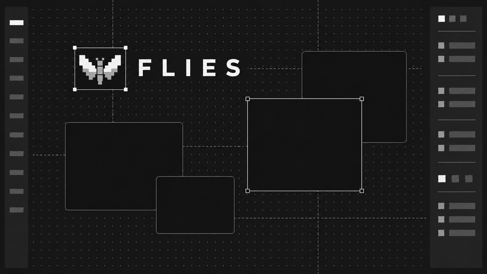

# Flies

A full-screen design canvas for the browser and the desktop, with an embedded MCP server so
agents edit the same document, undo history, and files you do.

- **Real canvas editing** — frames, groups, auto layout, text, images, SVG, and pen strokes with
  full undo/redo.
- **Firefly rendering**, an optional custom WebGL canvas renderer with automatic HTML/CSS fallback.
- **Code in, code out** — paste HTML, JSX, or TSX to get editable layers; copy any selection back
  out as Tailwind, CSS, or a React component.
- **Agent-native** — the desktop app exposes the document over MCP, sharing UI state, persistence,
  and history with manual edits.
- **Cloud files** — WorkOS sign-in, autosave, and immutable gzip revisions in private S3 storage.

Built with React 19, TypeScript, Vite+, TanStack Router, Tailwind CSS v4, and shadcn/ui on Base UI,
rendered through HTML/CSS or the custom Firefly WebGL library and shipped as a Tauri v2 desktop app, in a Bun workspace.

## Quick start

The editor talks to the API, so start the backend first.

```bash
vp install           # install deps (or bun install)
bun run api:dev      # backend API on :3001
vp -C apps/web dev   # frontend, Vite on :1420
bun run tauri:dev    # or: desktop app (starts apps/web on :1420)
```

Run `bun run check` and `bun run test` before submitting. See
[API setup](apps/api/README.md) for environment variables, migrations, and deployment.

## Tools

| Tool      | Key | Behavior                                                                                |
| --------- | --- | --------------------------------------------------------------------------------------- |
| Select    | V   | Select and drag objects; hover shows an outline, selection adds eight resize handles.   |
| Frame     | F   | Drag a white frame, or click to create one at 400 × 300.                                |
| Rectangle | R   | Drag a rectangle, or click to create one at 160 × 120.                                  |
| Text      | T   | Click to place and edit multiline text in 24 px Arial.                                  |
| Image     | I   | Open the local image picker; image files can also be pasted or dropped onto the canvas. |
| Pen       | P   | Draw freehand strokes; the pen stays active for subsequent strokes.                     |
| Hand      | H   | Drag to pan; hold Space for temporary hand mode with another tool selected.             |

## Packages

- `packages/canvas` — canvas engine (`@flies/canvas`): document model, geometry, GPU renderer, clipboard
- `packages/html` — shared HTML/JSX/TSX import, sanitization, DOM measurement, and Tailwind (`@flies/html`)
- `apps/web` — Vite+ React app for the browser and the desktop webview
- `apps/desktop` — Tauri v2 native shell and MCP server
- `apps/api` — Bun + Hono, WorkOS, Drizzle/Postgres, immutable S3 revisions

## Documentation

- [Canvas reference](docs/canvas.md) — tools, layers, properties, text, clipboard, shortcuts
- [Architecture](docs/architecture.md) — repo layout, rendering, files and sync, MCP
- [Development](docs/development.md) — commands, conventions, desktop releases
- [Design system](docs/design-system.md) — dark theme tokens and UI components
- [Canvas performance](docs/canvas-performance.md) — benchmark methodology, results, and limits
- [MCP guide](apps/desktop/src/mcp/README.md) — tools, Tailwind, and HTML import
- [API setup](apps/api/README.md) — environment, database, storage, deployment
